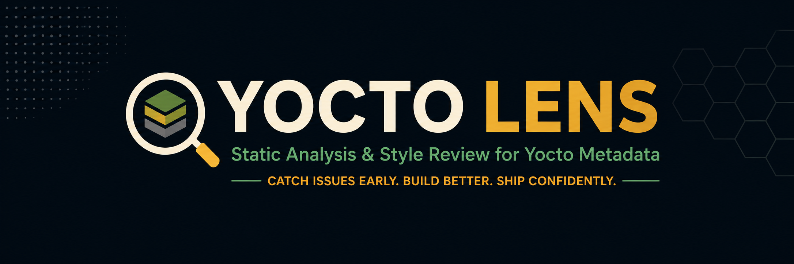
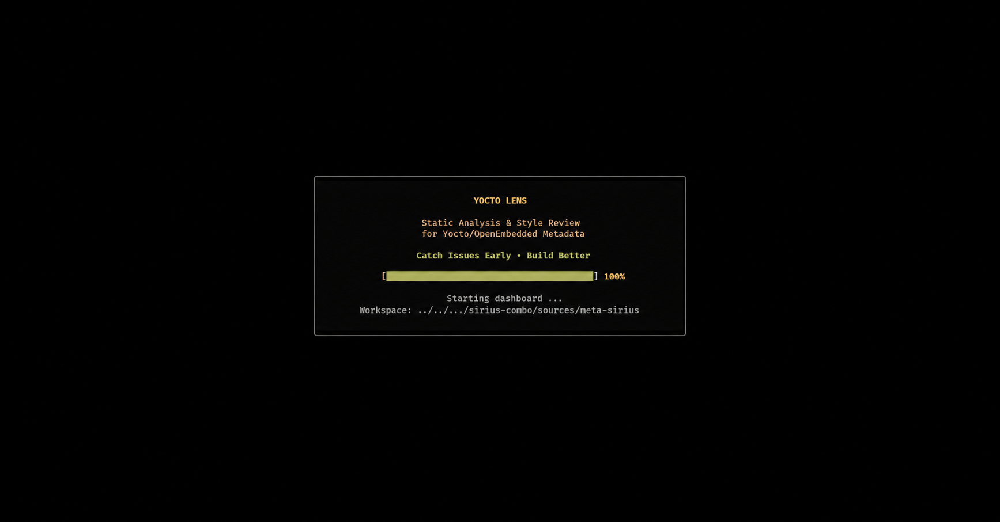
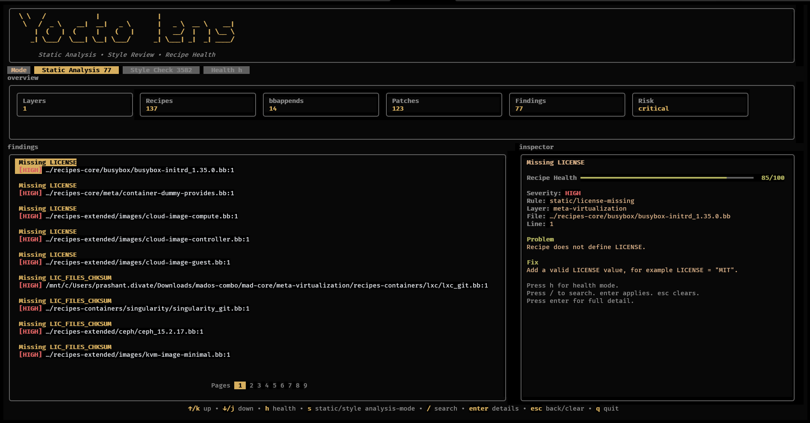

<p align="center">
  <picture>
    <!-- Logo displayed to Dark Mode users -->
    <source media="(prefers-color-scheme: dark)" srcset="docs/images/logo-dark.png">
    <!-- Default Logo displayed to Light Mode users -->
    
  </picture>
</p>

<p align="center">
  <a href="https://github.com/prashantdivate/yocto-lens/actions">
    
  </a>
  <a href="https://github.com/prashantdivate/yocto-lens/releases">
    
  </a>
  <a href="https://github.com/prashantdivate/yocto-lens/issues">
    
  </a>
  <a href="https://github.com/prashantdivate/yocto-lens/pulls">
    
  </a>
  <a href="https://github.com/prashantdivate/yocto-lens">
    
  </a>
  <a href="https://github.com/prashantdivate/yocto-lens/blob/main/LICENSE">
    
  </a>
  
  
  
  <a href="https://github.com/prashantdivate/yocto-lens/stargazers">
    
  </a>
  <a href="https://github.com/prashantdivate/yocto-lens/network/members">
    
  </a>
  <a href="https://hits.sh/github.com/prashantdivate/yocto-lens/">
    
  </a>
</p>

<br>

# Yocto Lens — BitBake Linter & Static Analysis Tool

`yocto-lens` is a lightning-fast, terminal-based **Static Code Analysis, Style Review, and Recipe Health Auditing engine** built specifically for Yocto Project and OpenEmbedded layers.

As an advanced **BitBake linter**, Yocto Lens helps embedded Linux developers proactively identify security vulnerabilities, maintainability regressions, layer dependency bottlenecks, patch quality concerns, and metadata style violations before they break your CI/CD pipelines or target hardware builds.

### Key Targets Scanned:
* **BitBake Recipes & Appends:** `.bb` and `.bbappend` configuration files
* **Patch Modifications:** `.patch` and upstream diff structures
* **Layer Definitions:** `conf/layer.conf` boundaries

*Designed for absolute portability: Yocto Lens acts as a standalone utility working seamlessly across any workspace layout. It does not depend on KAS configurations, massive Docker containers, repo manifests, or specific environmental variables.*

---

## Key Framework Features

> ⚠️ **Note:** `yocto-lens` is under active development. Expect rapid feature expansion, performance scaling, and frequent updates.

### 🛡️ Static Analysis & Security Auditing
Our core static analysis rules evaluate structural correctness, security configurations, build reproducibility, and system integration risks.
* **Vulnerability Scans:** Detects floating `SRCREV`, high-risk `AUTOREV` usage, and insecure `SRC_URI` protocols (e.g., unencrypted HTTP).
* **Secrets Detection:** Scans metadata lines for hardcoded credentials, API tokens, and credentials.
* **Path Sanitation:** Flags host-specific absolute filesystem paths leaking into compilation contexts.
* **Orphan Asset Identification:** Automatically finds dangling `.bbappend` configurations missing baseline targets.
* **Layer Layer Validation:** Evaluates structural problems like duplicate recipe definitions across overlapping layers.
* **Dependency Analysis:** Maps missing `LAYERSERIES_COMPAT` declarations, missing `BBFILE_COLLECTIONS`, isolated layer instances, and cyclic layer dependency faults.
* **License Compliance:** Identifies absent `LICENSE` or `LIC_FILES_CHKSUM` entries, highlights explicit GPLv3 package inclusions, and surfaces custom `CLOSED` license tracking warnings.

### 🎨 Metadata Style & Syntax Review
Ensure your code complies with OpenEmbedded syntax guidelines to enforce high readability and automated review hygiene.
* **Descriptive Validation:** Finds variables lacking essential `SUMMARY` or `DESCRIPTION` documentation fields.
* **Formatting Controls:** Enforces rigid variable assignment ordering rules, line length restrictions, and strips trailing whitespaces.
* **Syntax Optimization:** Migrates and flags legacy syntax strings such as the outdated overrides notation (`_append`, `_prepend`, `_remove`).
* **Conventions Compliance:** Checks recipe file names against canonical naming rules and verifies compliance of internal patch metadata headers.

### 🩺 Upstream Patch Quality Auditor
* **Upstream Standards:** Verifies mandatory `Upstream-Status` configurations and authenticates `Signed-off-by` developer signatures.
* **Structure Audits:** Isolates invalid contextual diff blocks, strips accidental structural secrets, and confirms CVE validation criteria.

### 💻 Interactive Terminal UI (TUI) Dashboard
* Switch instantly between dedicated **Static Analysis**, **Style Check**, and **Recipe Health** execution tabs.
* Real-time calculation engine computing granular health scores and population leaderboards.
* Features a high-fidelity inline Inspector Panel, deep-dive detail views, and lightning-fast search filters.
* Fully supports raw console telemetry data output pipelines via **JSON** and **SARIF** formatting exports.

---

## 📸 Screenshots & Visual Interface

### TUI Launch Interface
<p align="center">
  
</p>

### Main Analytics Dashboard
<p align="center">
  
</p>

---

## Installation & Getting Started

Navigate to the [Yocto Lens Releases Page](https://github.com/prashantdivate/yocto-lens/releases) and download the optimized binary tailored for your workstation operating system.

### Linux / macOS Environment Setup:
```bash
chmod +x yocto-lens
./yocto-lens <path_to_yocto_layer>
```

### Windows PowerShell Execution:
```powershell
.\yocto-lens.exe <path_to_yocto_layer>
```

---

## CLI Usage Reference

### Standard Workspace Scanning:
To scan a target project root folder recursively, supply the explicit workspace destination:
```bash
yocto-lens <path_to_yocto_layer>
```

### Multiple Layer Inspection:
Evaluate cross-layer dependencies or naming anomalies simultaneously by declaring multiple arguments:
```bash
yocto-lens meta-custom meta-product meta-security
```

### Headless CI/CD Pipeline Automation:
Execute analytical evaluations without starting the interactive terminal layout layer:
```bash
yocto-lens --no-tui /path/to/meta-custom
```

### Performance Profiling:
Print phase timings for large workspace scans:
```bash
yocto-lens --profile /path/to/meta-openembedded
```

### Isolated Scope Telemetry Checks:
```bash
# Target only structural vulnerabilities and security flags
yocto-lens --no-tui --mode static /path/to/meta-custom

# Enforce code styling standards exclusively
yocto-lens --no-tui --mode style /path/to/meta-custom
```

### Exporting Structured Reports:
```bash
# Generate comprehensive JSON formats for internal reporting
yocto-lens <path_to_yocto_layer> --json report.json

# Produce industry-standard SARIF data for GitHub Security Code Scanning integration
yocto-lens <path_to_yocto_layer> --sarif report.sarif
```

### Project Configuration:
Place `.yocto-lens.json` or `yocto-lens.json` in the scan root to tune CI behavior without changing source code:
```json
{
  "target_release": "scarthgap",
  "exclude": [
    "recipes-test/**",
    "**/testdata/**"
  ],
  "disabled_rules": [
    "style/*"
  ],
  "severity": {
    "static/license-closed": "HIGH"
  }
}
```

Inline suppressions are also supported for intentional exceptions:
```bitbake
# yocto-lens-disable-next-line static/license-closed
LICENSE = "CLOSED"
```

---

## Keyboard Shortcuts

| Shortcut Key | Triggered Navigation Action |
| :--- | :--- |
| `↑` / `↓` | Navigate active metadata findings sequentially |
| `Enter` | Expand the deep-dive diagnostic inspector panel view |
| `Esc` | Return safely to the preceding dashboard menu grid |
| `/` | Initialize inline global fuzzy text filtering pattern |
| `s` / `Tab` | Pivot application context between static analysis and styling diagnostics |
| `h` | Launch the overarching Recipe Health Score leaderboard matrix |
| `q` | Immediately terminate the interactive TUI application safely |

---

## Dynamic Fuzzy Search Filtering

Type `/` directly during a runtime session to execute live queries across all generated reports. The searching mechanics query properties including:
* Rule ID & String Contexts
* Severity Classifications (`HIGH`, `WARN`, `INFO`)
* Category Classifications & Exact Filenames
* Target Directory Strings, Layers, and Diagnostic Messages

```text
# Search Query Examples:
license
autorev
bbappend
patch
secret
style
HIGH
srcuri
```

---

## 🛠️ Compilation & Building From Source

### Prerequisites:
Ensure your development machine has [Go (Golang) version 1.22+](https://go.dev) successfully configured.

```bash
# Clone the repository
git clone https://github.com/prashantdivate/yocto-lens.git
cd yocto-lens

# Compile localized architecture release structures
go build -o yocto-lens ./cmd/yocto-lens
```

## 🛠 Build From Source

```bash
git clone https://github.com/prashantdivate/yocto-lens.git

cd yocto-lens

go build -o yocto-lens ./cmd/yocto-lens
```

Run:

```bash
./yocto-lens /path/to/meta-custom
```

---

## Real World Usage

Yocto Lens is already being used to automate metadata quality checks in Yocto BSP development workflows.

| Project | Usage |
|----------|--------|
| Dynamic Devices BSP | CI validation and metadata quality checks |

## Usage In CI

Yocto Lens is already being integrated into automated Yocto validation pipelines.

Example:

- Dynamic Devices BSP Layer
  - https://github.com/DynamicDevices/meta-dynamicdevices-bsp

CI Integration Script:

https://github.com/DynamicDevices/meta-dynamicdevices-bsp/blob/main/scripts/yocto-lens-ci.sh

## CI Example

```bash
./yocto-lens --no-tui --mode static --json yocto-lens.json --sarif yocto-lens.sarif .
```
---

## 🤝 Community Contributions
Community feature inquiries, architectural bug tracking reports, and open GitHub Pull Requests are highly encouraged.

If Yocto Lens reduces your code review overhead or hardens your build environments, please consider dropping a project ⭐!

## 📄 Licensing Rights
This system is licensed entirely under the MIT Open Source License.
